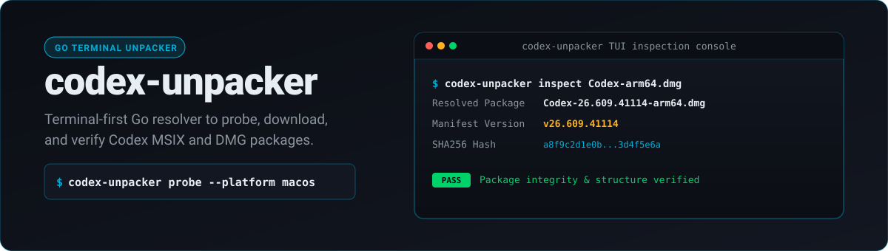
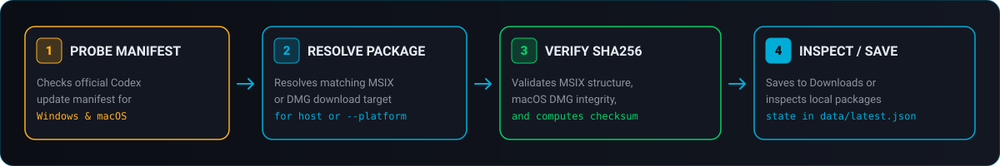

<p align="center">
  
</p>

<p align="center">
  
</p>

<p align="center">
  <a href="https://go.dev">>
    
  </a>
  
  
  <a href="LICENSE">
    
  </a>
</p>

---

## Overview

`codex-unpacker` is a Go application for Windows and macOS Codex packages.

The application reads official Codex update manifests. It finds the package that matches the selected platform and architecture. It can download the package and verify its structure and SHA256 checksum.

You can use the application in two ways:

- Use the interactive terminal user interface for manual work.
- Use CLI commands in scripts and automated workflows.

### Main Functions

- **Probe manifests**: Read the official Windows and macOS Codex update endpoints and get the latest version.
- **Resolve packages**: Find the matching `.msix` package for Windows or `.dmg` package for macOS.
- **Verify integrity**: Verify the MSIX structure or the DMG SHA256 checksum.
- **Inspect local files**: Inspect an existing `.msix` or `.dmg` file without a download.
- **Save state**: Save download history for each target platform in `data/latest.json`.

<br />

<p align="center">
  
</p>

---

## Build and Start

### Prerequisites

- Go 1.22 or later
- Windows x64, macOS arm64, or macOS x64

### Build from Source

```powershell
go build -o codex-unpacker.exe .
```

### Start the Interactive Interface

```powershell
.\codex-unpacker.exe
```

When you run the application without a subcommand, it starts the full-screen Bubble Tea terminal interface.

---

## CLI Commands

```powershell
# Get the latest release information for the host operating system
.\codex-unpacker.exe probe

# Get release information for a specified platform and architecture
.\codex-unpacker.exe probe --platform macos --arch arm64

# Download the latest matching package to the default Downloads directory
.\codex-unpacker.exe download

# Download a package for a specified platform and architecture
.\codex-unpacker.exe download --platform macos --arch arm64

# Use a custom download directory or output file name
.\codex-unpacker.exe download --output .\Downloads
.\codex-unpacker.exe download --output .\Downloads\codex-latest.msix

# Inspect a local package and print its version and SHA256 hash
.\codex-unpacker.exe inspect .\OpenAI.Codex_26.609.4994.0_x64.Msix
.\codex-unpacker.exe inspect .\Codex-26.609.41114-arm64.dmg
```

---

## Command Summary

| Command | Function | Default target or output |
|---|---|---|
| `probe` | Read the update manifest and print the latest version information. | Host platform |
| `download` | Find, download, and verify the latest matching package. | User `Downloads` directory |
| `inspect` | Verify an existing local `.msix` or `.dmg` file. | Terminal report |

---

## Architecture and State

- **Automatic target detection**: The `probe` and `download` commands use the host operating system and architecture when you do not set `--platform`.
- **Default storage**: The `download` command saves files in the user `Downloads` directory unless you set `--output`.
- **Separate state**: `data/latest.json` stores separate download state for Windows and macOS targets.
- **No GitHub Releases API dependency**: The application does not use the GitHub Releases API. It also does not require Node.js or Wails.

---

## License

This project uses the [MIT License](LICENSE).
